# BPM Automation - Complete Architecture Overview

**Document Purpose:** Technical architecture review for tech lead discussion
**Module:** bpm_automation (Odoo 18)
**Version:** 18.0.1.0.0
**Date:** 2026-01-30

---

## Executive Summary

The BPM Automation module implements a comprehensive workflow engine for Odoo 18 that enables business process automation without code. The architecture follows an **event-driven, asynchronous execution pattern** with the **outbox pattern** for reliability.

**Core Design Principles:**
1. **No-Code Configuration** - Admins build workflows via UI
2. **Asynchronous Execution** - Never blocks user operations
3. **Reliable Delivery** - Outbox pattern prevents lost actions
4. **Pluggable Architecture** - Extensible executors for actions and steps
5. **Odoo-Native Integration** - Leverages ir.cron, mail.activity, mail.template
6. **Observable** - Full audit trail and monitoring

---

## High-Level Architecture

```mermaid
graph TB
    subgraph "User Interface Layer"
        WF[Workflow Designer]
        TK[Task Management]
        DB[Dashboard & Monitoring]
    end
    
    subgraph "Trigger Detection Layer"
        TE[Trigger Engine]
        TM[ORM Trigger Mixin]
        WH[Webhook Controller]
        API[REST API Controller]
    end
    
    subgraph "Execution Engine Layer"
        OR[Orchestrator]
        SE[Step Executors]
        AE[Action Executors]
    end
    
    subgraph "Queue Layer"
        OB[Outbox Queue]
        BR[Parallel Branch Tracker]
    end
    
    subgraph "Data Layer"
        WD[Workflow Definitions]
        WI[Workflow Instances]
        SL[Step Execution Logs]
        TS[Human Tasks]
        EL[Execution Logs]
    end
    
    subgraph "Integration Layer"
        CR[ir.cron Jobs]
        MA[mail.activity]
        MT[mail.template]
        SA[ir.actions.server]
    end
    
    WF --> WD
    TK --> TS
    DB --> WI
    DB --> EL
    
    TM --> TE
    WH --> TE
    API --> TE
    
    TE --> WI
    TE --> OB
    
    OR --> OB
    OR --> SE
    OR --> AE
    
    SE --> WI
    SE --> SL
    SE --> BR
    
    AE --> WI
    AE --> SL
    
    OR --> CR
    TK --> MA
    AE --> MT
    AE --> SA
```



---

## Component Architecture

### 1. Data Models (17 Models)

#### 1.1 Workflow Definition Models
| Model | Purpose | Key Fields |
|--------|---------|-------------|
| [`bpm.workflow`](docs/plans/2026-01-30-bpm-automation-design.md#L172) | Workflow definition | name, code, model_id, state, version, step_ids, trigger_ids |
| [`bpm.workflow.step`](docs/plans/2026-01-30-bpm-automation-design.md#L293) | Steps in workflow | step_type, action_id, next_step_id, condition fields, parallel fields, task fields |
| [`bpm.action`](docs/plans/2026-01-30-bpm-automation-design.md#L493) | Reusable actions | action_type, model_id, field_mapping_ids, type-specific config |
| [`bpm.action.field.map`](docs/plans/2026-01-30-bpm-automation-design.md#L672) | Field mappings | field_id, value_type, static_value/expression/jinja_template |

#### 1.2 Trigger Models
| Model | Purpose | Key Fields |
|--------|---------|-------------|
| [`bpm.trigger`](docs/plans/2026-01-30-bpm-automation-design.md#L725) | Workflow triggers | trigger_type, model_id, domain_filter, watched_field_ids, cron_expression |
| [`bpm.webhook.endpoint`](docs/plans/2026-01-30-bpm-automation-design.md#L1331) | Webhook config | token, secret_key, allowed_ips, require_signature |
| [`bpm.webhook.call.log`](docs/plans/2026-01-30-bpm-automation-design.md#L1389) | Webhook history | endpoint_id, payload_json, processing_status |
| [`bpm.schedule.job`](docs/plans/2026-01-30-bpm-automation-design.md#L1432) | Cron wrapper | ir_cron_id, cron_expression, next_run, last_run |

#### 1.3 Execution Models
| Model | Purpose | Key Fields |
|--------|---------|-------------|
| [`bpm.workflow.instance`](docs/plans/2026-01-30-bpm-automation-design.md#L866) | Running instance | workflow_id, res_model, res_id, state, context_json, current_step_id |
| [`bpm.instance.step.log`](docs/plans/2026-01-30-bpm-automation-design.md#L994) | Step execution log | step_id, state, input_context, output_result, error_message, attempt_number |
| [`bpm.parallel.branch`](docs/plans/2026-01-30-bpm-automation-design.md#L1085) | Parallel tracking | split_step_log_id, join_step_id, branch_index, state |
| [`bpm.execution.log`](docs/plans/2026-01-30-bpm-automation-design.md#L1130) | Audit trail | instance_id, log_level, category, message, timestamp |

#### 1.4 Task Models
| Model | Purpose | Key Fields |
|--------|---------|-------------|
| [`bpm.task`](docs/plans/2026-01-30-bpm-automation-design.md#L1180) | Human tasks | instance_id, assignee_id, state, deadline, decision, escalation_level |
| [`bpm.task.response`](docs/plans/2026-01-30-bpm-automation-design.md#L1285) | Task responses | task_id, user_id, response_type, response_data, comment |

#### 1.5 Queue & Configuration Models
| Model | Purpose | Key Fields |
|--------|---------|-------------|
| [`bpm.outbox`](docs/plans/2026-01-30-bpm-automation-design.md#L1477) | Execution queue | instance_id, step_log_id, idempotency_key, state, scheduled_at, attempt_count |
| [`bpm.config.setting`](docs/plans/2026-01-30-bpm-automation-design.md#L1554) | Settings | key, value, value_type, company_id |
| [`bpm.action.registry`](docs/plans/2026-01-30-bpm-automation-design.md#L1595) | Function whitelist | python_path, is_safe, requires_approval, param_schema |

---

### 2. Trigger System Architecture

#### 2.1 Trigger Engine
**File:** `engine/trigger_engine.py`

**Responsibilities:**
- Cache active triggers for fast lookup
- Match incoming events to triggers
- Validate conditions and domains
- Create workflow instances
- Enqueue first step to outbox

**Key Methods:**
```python
class TriggerEngine:
    # Cache Management
    def _get_triggers_for_model(model_name, trigger_type)
    def _refresh_cache_if_needed()
    def invalidate_cache()
    
    # Record Event Handlers
    def on_record_create(model_name, records)
    def on_record_write(model_name, records, vals, old_values)
    def on_record_delete(model_name, records)
    
    # Time-Based Triggers
    def fire_scheduled(trigger_id)
    def check_deadline_triggers()
    
    # External Triggers
    def fire_webhook(endpoint_id, payload, headers, source_ip)
    def fire_manual(trigger_id, record=None, context=None)
    def fire_api(workflow_code, res_model=None, res_id=None, context=None)
    
    # Workflow Initiation
    def _start_workflow(trigger, record=None, extra_context=None)
    def _enqueue_step(instance, step, scheduled_at=None)
```

**Trigger Types Supported:**
1. **Record Events** - on_create, on_write, on_delete, on_field_change, on_condition
2. **Time-Based** - scheduled (cron), deadline-based
3. **External** - webhook, manual, API

#### 2.2 ORM Trigger Mixin
**File:** `models/bpm_trigger_mixin.py`

**Purpose:** Intercept ORM operations to trigger workflows

**How It Works:**
```python
class BpmTriggerMixin(models.AbstractModel):
    _name = 'bpm.trigger.mixin'
    
    @api.model_create_multi
    def create(self, vals_list):
        records = super().create(vals_list)
        if not self.env.context.get('bpm_skip_triggers'):
            self.env['bpm.trigger.engine'].on_record_create(self._name, records)
        return records
    
    def write(self, vals):
        # Capture old values for field change detection
        old_values = self._capture_old_values(vals)
        result = super().write(vals)
        if not self.env.context.get('bpm_skip_triggers'):
            self.env['bpm.trigger.engine'].on_record_write(self._name, self, vals, old_values)
        return result
    
    def unlink(self):
        if not self.env.context.get('bpm_skip_triggers'):
            self.env['bpm.trigger.engine'].on_record_delete(self._name, self)
        return super().unlink()
```

**Usage:**
```python
# Any model can inherit the mixin
class SaleOrder(models.Model):
    _inherit = ['sale.order', 'bpm.trigger.mixin']
```

**Benefits:**
- No code changes required on target models
- Automatic trigger detection
- Context flag to prevent recursive triggers

---

### 3. Execution Engine Architecture

#### 3.1 Orchestrator (Cron-Based Worker)
**File:** `engine/orchestrator.py`

**Purpose:** Process outbox queue asynchronously

**Architecture Pattern:** Outbox Pattern (Reliable Message Queue)

**How It Works:**
```
1. Cron runs every 1 minute
2. Acquire batch of pending items (with locking)
3. For each item:
   a. Update step log to 'running'
   b. Get appropriate executor
   c. Build execution context
   d. Execute step
   e. Handle result (success/failure)
4. Commit transaction
```

**Key Methods:**
```python
class BpmOrchestrator(models.TransientModel):
    @api.model
    def process_outbox():
        # Main entry point - called by cron
        
    def _acquire_items(batch_size):
        # Pessimistic locking with FOR UPDATE SKIP LOCKED
        
    def _process_item(item):
        # Execute single step
        
    def _get_executor(step_type):
        # Map step type to executor model
        
    def _build_context(instance, step_log):
        # Build execution context
        
    def _handle_result(item, step_log, result, duration_ms):
        # Dispatch to success/failure handlers
        
    def _handle_success(item, step_log, result, duration_ms):
        # Update logs, enqueue next steps
        
    def _handle_failure(item, step_log, result, duration_ms):
        # Retry logic or final failure handling
        
    def _schedule_retry(item, step_log, attempt, max_attempts):
        # Exponential backoff with jitter
        
    def _handle_final_failure(item, step_log, error_msg):
        # Execute on_error_step or mark instance failed
```

**Database Locking:**
```sql
-- Acquire items with locking to prevent duplicate processing
UPDATE bpm_outbox
SET state = 'processing',
    locked_at = NOW(),
    locked_by = 'worker-id'
WHERE id IN (
    SELECT id FROM bpm_outbox
    WHERE state = 'pending'
      AND scheduled_at <= NOW()
      AND (locked_at IS NULL OR locked_at < NOW() - INTERVAL '10 minutes')
    ORDER BY scheduled_at, id
    LIMIT 50
    FOR UPDATE SKIP LOCKED  -- Skip locked items, don't wait
)
RETURNING id
```

**Benefits:**
- Multiple workers can run concurrently
- No duplicate processing
- Automatic retry with exponential backoff
- Transactional reliability

#### 3.2 Step Executors
**Directory:** `engine/executors/`

**Base Class:**
```python
class BpmExecutorBase(models.TransientModel):
    _name = 'bpm.executor.base'
    
    def execute(self, step, ctx):
        raise NotImplementedError()
    
    def _safe_eval(self, expression, ctx):
        # Safely evaluate Python expression
        # Available: record, ctx, env, user, datetime, json
        
    def _render_jinja(self, template, ctx):
        # Render Jinja2 template
        # Available: record, ctx, user, company, now
```

**Executor Types:**

| Executor | Step Type | Responsibility |
|-----------|-----------|---------------|
| [`bpm.executor.action`](docs/plans/2026-01-30-bpm-automation-design.md#L2650) | action | Execute action via action engine |
| [`bpm.executor.condition`](docs/plans/2026-01-30-bpm-automation-design.md#L2463) | condition | Evaluate expression, branch to on_true/on_false |
| [`bpm.executor.parallel.split`](docs/plans/2026-01-30-bpm-parallel-execution-architecture.md) | parallel_split | Create multiple branches, return step_ids |
| [`bpm.executor.parallel.join`](docs/plans/2026-01-30-bpm-parallel-execution-architecture.md) | parallel_join | Wait for branches (all/any) |
| [`bpm.executor.human.task`](docs/plans/2026-01-30-bpm-automation-design.md#L2495) | human_task | Create task, assignee, wait for completion |
| [`bpm.executor.wait.event`](docs/plans/2026-01-30-bpm-automation-design.md) | wait_event | Wait for external event, handle timeout |
| [`bpm.executor.delay`](docs/plans/2026-01-30-bpm-automation-design.md#L2562) | delay | Calculate delay, return wait_until timestamp |
| [`bpm.executor.stop`](docs/plans/2026-01-30-bpm-automation-design.md) | stop | Mark workflow as success/error/cancel |

---

### 4. Action Executors Architecture

#### 4.1 Action Engine
**File:** `engine/action_engine.py`

**Purpose:** Dispatch actions to appropriate executor

```python
class BpmActionEngine(models.TransientModel):
    ACTION_EXECUTORS = {
        'update_record': 'bpm.action.executor.update.record',
        'create_record': 'bpm.action.executor.create.record',
        'delete_record': 'bpm.action.executor.delete.record',
        'link_records': 'bpm.action.executor.link.records',
        'server_action': 'bpm.action.executor.server.action',
        'send_email': 'bpm.action.executor.send.email',
        'send_message': 'bpm.action.executor.send.message',
        'send_sms': 'bpm.action.executor.send.sms',
        'create_activity': 'bpm.action.executor.create.activity',
        'http_request': 'bpm.action.executor.http.request',
        'webhook_call': 'bpm.action.executor.webhook.call',
        'execute_python': 'bpm.action.executor.execute.python',
    }
    
    def execute_action(self, action, ctx):
        executor_model = self.ACTION_EXECUTORS[action.action_type]
        executor = self.env[executor_model]
        return executor.execute(action, ctx)
```

#### 4.2 Action Executor Types

**Directory:** `engine/action_executors/`

| Category | Executors | Description |
|-----------|-----------|-------------|
| **Record Actions** | update_record, create_record, delete_record, link_records, server_action | CRUD operations on Odoo records |
| **Communication** | send_email, send_message, send_sms, create_activity | Email, chatter, SMS, activities |
| **Integration** | http_request, webhook_call, execute_python | External APIs, webhooks, custom code |

**Example: HTTP Request Executor**
```python
class BpmActionExecutorHttpRequest(models.TransientModel):
    _name = 'bpm.action.executor.http.request'
    _inherit = 'bpm.action.executor.base'
    
    def execute(self, action, ctx):
        # Render URL, headers, body with Jinja
        url = self._render_jinja(action.http_url, ctx)
        headers = json.loads(self._render_jinja(action.http_headers, ctx))
        body = self._render_jinja(action.http_body, ctx)
        
        # Handle authentication
        auth = self._build_auth(action)
        
        # Make HTTP request
        response = requests.request(
            method=action.http_method,
            url=url,
            headers=headers,
            data=body,
            auth=auth,
            timeout=action.http_timeout
        )
        
        # Validate response
        if response.status_code not in success_codes:
            return {'success': False, 'error': f'HTTP {response.status_code}'}
        
        return {
            'success': True,
            'output': {'status_code': response.status_code, 'response': response.json()},
            'context_updates': {'http_response': response.json()}
        }
```

---

### 5. Parallel Execution Architecture

**Detailed Document:** [`docs/plans/2026-01-30-bpm-parallel-execution-architecture.md`](docs/plans/2026-01-30-bpm-parallel-execution-architecture.md)

**Key Concepts:**

1. **Split Step** - Creates multiple independent branches
2. **Branch Model** - Tracks each branch's state
3. **Independent Execution** - Branches execute via outbox queue
4. **Join Logic** - Waits for 'all' or 'any' branches
5. **Result Aggregation** - Join receives results in `_parallel_results`

**Execution Flow:**
```
Split Executor
    ↓
Returns [step_ids]
    ↓
Orchestrator creates branch records
    ↓
Enqueues first step of each branch to outbox
    ↓
Branches execute independently
    ↓
Each branch completes → _complete_branch()
    ↓
Join logic checks condition
    ↓
If met → Execute join step
```

**Use Cases:**
- Parallel approvals (Finance AND Manager)
- Race conditions (First supplier to respond)
- Concurrent updates (CRM + ERP + Billing)

---

### 6. Human Task System Architecture

#### 6.1 Task Model
**File:** `models/bpm_task.py`

**Key Features:**
- Assignment to user, group, field, or expression
- Deadline tracking with escalation
- Integration with Odoo's mail.activity
- Chatter support
- Decision tracking (approve/reject/custom)

**State Machine:**
```
pending → claimed → completed
    ↓
expired
```

#### 6.2 Task Lifecycle

```python
# 1. Task Created (by human_task executor)
task = self.env['bpm.task'].create({
    'name': 'Approval Required',
    'instance_id': instance_id,
    'assignee_id': user_id,
    'deadline': deadline,
    'state': 'pending'
})

# 2. User Claims Task
task.action_claim()  # Updates state to 'claimed', assigns to user

# 3. User Approves Task
task.action_approve(comment='Approved')
# - Updates state to 'completed'
# - Stores decision and comment
# - Resumes workflow with on_approve step
# - Marks mail.activity as done

# 4. Escalation (if deadline exceeded)
task.check_escalation()
# - Increments escalation_level
# - Reassigns to escalation user/group
# - Sends notification
```

#### 6.3 Mail Activity Integration

```python
# When task is created
mail_activity = self.env['mail.activity'].create({
    'res_id': task.instance_id.res_id,
    'res_model_id': task.instance_id.res_model,
    'activity_type_id': activity_type_id,
    'summary': task.name,
    'note': task.instructions,
    'user_id': task.assignee_id.id,
    'date_deadline': task.deadline
})

# When task is completed
mail_activity.action_done()
```

---

### 7. API & Webhook Architecture

#### 7.1 Webhook Controller
**File:** `controllers/webhook.py`

**Route:** `/bpm/webhook/<string:token>`

**Authentication:**
- Token-based (unique per endpoint)
- Optional HMAC signature verification
- Optional IP restriction

**Flow:**
```
1. External system POSTs to webhook URL
2. Controller validates token
3. Validates HMAC signature if required
4. Validates IP if restricted
5. Calls trigger_engine.fire_webhook()
6. Updates endpoint statistics
7. Returns instance_id or error
```

#### 7.2 REST API Controller
**File:** `controllers/api.py`

**Endpoints:**

| Method | Route | Purpose |
|---------|--------|---------|
| GET | `/api/bpm/workflows` | List active workflows |
| POST | `/api/bpm/workflows/<code>/start` | Start workflow |
| GET | `/api/bpm/instances/<id>` | Get instance details |
| POST | `/api/bpm/tasks/<id>/complete` | Complete task |
| GET | `/api/bpm/tasks/<id>` | Get task details |

**Authentication:** Requires user authentication (auth='user')

---

### 8. Security Architecture

#### 8.1 Security Groups

| Group | Permissions |
|--------|-------------|
| `BPM User` | View workflows, instances, tasks; Complete assigned tasks |
| `BPM Designer` | Create/edit workflows, actions, triggers |
| `BPM Manager` | Manage instances, tasks, view all logs |
| `BPM Administrator` | Full access including configuration, registry |

#### 8.2 Access Control

**Model Access:**
- Users: Read-only on workflows
- Designers: Read/write on workflows, actions, triggers
- Managers: Full access on instances, tasks
- Admins: Full access on all models

**Record Rules:**
- Tasks: Users see only their assigned tasks (or group tasks)
- Instances: Managers see all, users see only their records

#### 8.3 Python Execution Security

**Whitelist Approach:**
```python
# Only whitelisted functions can be called
class BpmActionRegistry(models.Model):
    python_path = fields.Char('Python Path')  # e.g., 'my_module.utils.calculate_tax'
    is_safe = fields.Boolean('Is Safe')  # Approved functions
    requires_approval = fields.Boolean('Requires Approval', default=True)
    
    def execute(self, ctx):
        # Dynamically import and execute
        module_path, func_name = self.python_path.rsplit('.', 1)
        module = importlib.import_module(module_path)
        func = getattr(module, func_name)
        return func(ctx)
```

**Sandboxing:**
- Custom code runs in limited context
- No access to dangerous functions (eval, exec, open, etc.)
- Admin approval required for new functions

---

### 9. Database Schema

#### 9.1 Key Indexes

```sql
-- Outbox queue performance
CREATE INDEX idx_bpm_outbox_state_scheduled ON bpm_outbox(state, scheduled_at);
CREATE UNIQUE INDEX idx_bpm_outbox_idempotency ON bpm_outbox(idempotency_key);

-- Instance queries
CREATE INDEX idx_bpm_instance_state ON bpm_workflow_instance(state);
CREATE INDEX idx_bpm_instance_workflow ON bpm_workflow_instance(workflow_id);
CREATE INDEX idx_bpm_instance_record ON bpm_workflow_instance(res_model, res_id);

-- Step log queries
CREATE INDEX idx_bpm_step_log_instance ON bpm_instance_step_log(instance_id, state);
CREATE INDEX idx_bpm_step_log_branch ON bpm_instance_step_log(branch_id);

-- Execution logs
CREATE INDEX idx_bpm_exec_log_timestamp ON bpm_execution_log(timestamp);
CREATE INDEX idx_bpm_exec_log_instance ON bpm_execution_log(instance_id);
```

#### 9.2 Foreign Keys

```sql
-- Workflow relations
ALTER TABLE bpm_workflow_step ADD CONSTRAINT fk_step_workflow 
    FOREIGN KEY (workflow_id) REFERENCES bpm_workflow(id) ON DELETE CASCADE;

-- Instance relations
ALTER TABLE bpm_workflow_instance ADD CONSTRAINT fk_instance_workflow 
    FOREIGN KEY (workflow_id) REFERENCES bpm_workflow(id) ON DELETE RESTRICT;

-- Outbox relations
ALTER TABLE bpm_outbox ADD CONSTRAINT fk_outbox_instance 
    FOREIGN KEY (instance_id) REFERENCES bpm_workflow_instance(id) ON DELETE CASCADE;
```

---

### 10. Cron Jobs

| Job Name | Method | Interval | Purpose |
|-----------|---------|-----------|---------|
| BPM: Process Workflow Queue | `process_outbox()` | 1 minute | Process outbox queue |
| BPM: Check Deadline Triggers | `check_deadline_triggers()` | 15 minutes | Check deadline-based triggers |
| BPM: Check Task Escalations | `check_escalations()` | 15 minutes | Escalate overdue tasks |
| BPM: Cleanup Old Logs | `_cleanup_logs()` | Daily | Remove logs older than retention period |

---

### 11. Configuration Management

#### 11.1 System Parameters

| Key | Default | Type | Description |
|-----|---------|-------|-------------|
| `orchestrator_batch_size` | 50 | integer | Items per cron tick |
| `orchestrator_interval` | 1 | integer | Cron interval (minutes) |
| `outbox_retry_delay` | 5 | integer | Base retry delay (minutes) |
| `outbox_max_retries` | 3 | integer | Maximum retry attempts |
| `task_default_deadline` | 24 | integer | Hours for task deadline |
| `task_escalation_check` | 15 | integer | Minutes between escalation checks |
| `log_retention_days` | 90 | integer | Days to keep execution logs |
| `webhook_timeout` | 30 | integer | Seconds for webhook timeout |
| `http_default_timeout` | 30 | integer | Seconds for HTTP requests |

#### 11.2 Configuration Model

```python
class BpmConfigSetting(models.Model):
    _name = 'bpm.config.setting'
    
    key = fields.Char('Key', required=True)
    value = fields.Text('Value')
    value_type = fields.Selection([
        ('string', 'String'),
        ('integer', 'Integer'),
        ('float', 'Float'),
        ('boolean', 'Boolean'),
        ('json', 'JSON'),
    ])
    company_id = fields.Many2one('res.company')
    
    _sql_constraints = [
        ('key_company_unique', 'UNIQUE(key, company_id)')
    ]
```

---

### 12. File Structure

```
bpm_automation/
├── __init__.py
├── __manifest__.py
├── controllers/
│   ├── __init__.py
│   ├── api.py              # REST API endpoints
│   └── webhook.py          # Webhook handler
├── data/
│   ├── config_data.xml      # Default configuration
│   └── cron_data.xml       # Cron job definitions
├── engine/
│   ├── __init__.py
│   ├── orchestrator.py      # Main execution engine
│   ├── trigger_engine.py   # Trigger detection
│   ├── action_engine.py    # Action dispatcher
│   ├── executors/
│   │   ├── __init__.py
│   │   ├── base.py        # Base executor class
│   │   ├── action.py      # Action step executor
│   │   ├── condition.py   # Condition gateway
│   │   ├── parallel_split.py
│   │   ├── parallel_join.py
│   │   ├── human_task.py
│   │   ├── wait_event.py
│   │   ├── delay.py
│   │   └── stop.py
│   └── action_executors/
│       ├── __init__.py
│       ├── base.py        # Base action executor
│       ├── update_record.py
│       ├── create_record.py
│       ├── delete_record.py
│       ├── link_records.py
│       ├── server_action.py
│       ├── send_email.py
│       ├── send_message.py
│       ├── send_sms.py
│       ├── create_activity.py
│       ├── http_request.py
│       ├── webhook_call.py
│       └── execute_python.py
├── models/
│   ├── __init__.py
│   ├── bpm_workflow.py
│   ├── bpm_workflow_step.py
│   ├── bpm_action.py
│   ├── bpm_action_field_map.py
│   ├── bpm_trigger.py
│   ├── bpm_webhook_endpoint.py
│   ├── bpm_webhook_call_log.py
│   ├── bpm_schedule_job.py
│   ├── bpm_workflow_instance.py
│   ├── bpm_instance_step_log.py
│   ├── bpm_parallel_branch.py
│   ├── bpm_execution_log.py
│   ├── bpm_task.py
│   ├── bpm_task_response.py
│   ├── bpm_outbox.py
│   ├── bpm_config_setting.py
│   ├── bpm_action_registry.py
│   └── bpm_trigger_mixin.py
├── security/
│   ├── security.xml         # Security groups
│   ├── ir.model.access.csv # Access rights
│   └── record_rules.xml    # Record rules
├── views/
│   ├── menu.xml
│   ├── bpm_workflow_views.xml
│   ├── bpm_instance_views.xml
│   ├── bpm_task_views.xml
│   └── bpm_dashboard_views.xml
├── wizard/
│   └── step_config_wizard.py
└── tests/
    ├── __init__.py
    ├── test_workflow.py
    ├── test_execution.py
    └── test_triggers.py
```

---

### 13. Implementation Phases

| Phase | Duration | Focus | Deliverables |
|--------|----------|-------|-------------|
| **Phase 1** | Week 1 | Foundation Setup | Module structure, security, menus |
| **Phase 2** | Week 1-2 | Core Data Models | 17 models with fields and relations |
| **Phase 3** | Week 2-3 | Trigger Engine | All trigger types, ORM mixin |
| **Phase 4** | Week 3 | Execution Engine | Orchestrator, retry logic, locking |
| **Phase 5** | Week 4 | Step Executors | 8 step executors |
| **Phase 6** | Week 4-5 | Action Executors | 18 action executors |
| **Phase 7** | Week 5-6 | Human Task System | Task model, escalation, mail.activity |
| **Phase 8** | Week 6-7 | Webhooks & API | Webhook controller, REST API |
| **Phase 9** | Week 7 | Dashboard & Monitoring | UI views, dashboard, logs |
| **Phase 10** | Week 8 | Configuration & Polish | Settings, wizards, docs |
| **Phase 11** | Week 9 | Testing | Unit, integration, API, performance tests |
| **Phase 12** | Week 10 | Deployment | Optimization, security review, release |

---

### 14. Key Technical Decisions

#### 14.1 Outbox Pattern vs Direct Execution

**Decision:** Use Outbox Pattern

**Rationale:**
- **Reliability:** Guaranteed execution even if system crashes
- **Asynchronous:** Never blocks user operations
- **Retry Logic:** Built-in exponential backoff
- **Scalability:** Can process batches efficiently
- **Observability:** Full audit trail in queue

**Trade-offs:**
- **Latency:** Execution is delayed (1-2 minutes max)
- **Complexity:** Requires orchestrator and queue management
- **Storage:** Additional table for outbox items

**Alternative Rejected:** Direct execution in trigger handlers
- Would block user operations
- No retry mechanism
- Difficult to monitor

#### 14.2 Cron-Based vs Background Workers

**Decision:** Cron-Based Orchestrator

**Rationale:**
- **Odoo-Native:** Leverages ir.cron infrastructure
- **Simple:** No additional process management
- **Reliable:** Built-in retry and scheduling
- **Multi-Instance:** Works on odoo.sh

**Trade-offs:**
- **Latency:** Limited to cron interval (1 minute)
- **Throughput:** Limited to batch size per tick

**Alternative Considered:** Background workers (Celery, RQ)
- More complex deployment
- Requires additional infrastructure
- Overkill for most use cases

#### 14.3 ORM Mixin vs Custom Hooks

**Decision:** ORM Mixin

**Rationale:**
- **No Code Changes:** Target models just inherit mixin
- **Automatic:** Triggers work without modifications
- **Flexible:** Can be added to any model
- **Clean:** Separation of concerns

**Trade-offs:**
- **Performance:** Slight overhead on create/write/unlink
- **Complexity:** Requires careful context management

**Alternative Rejected:** Custom hooks (e.g., `_bpm_on_create`)
- Would require modifying Odoo core
- Not extensible by third-party modules

#### 14.4 Parallel Execution Strategy

**Decision:** Independent Branches with Join Step

**Rationale:**
- **True Parallelism:** Branches execute independently
- **Flexible:** Supports both 'all' and 'any' join types
- **Observable:** Each branch has its own state
- **Scalable:** No limit on branch count

**Trade-offs:**
- **Complexity:** Requires branch tracking model
- **Context Isolation:** Branches can't share context

**Alternative Rejected:** Sequential execution
- Would defeat purpose of parallel workflows
- Poor performance for concurrent operations

#### 14.5 Python Execution Security

**Decision:** Whitelist with Admin Approval

**Rationale:**
- **Controlled:** Only approved functions can be called
- **Auditable:** All functions registered in database
- **Safe:** Admin review before use
- **Extensible:** Custom modules can add functions

**Trade-offs:**
- **Overhead:** Requires admin approval for each function
- **Limited:** Can't execute arbitrary code

**Alternative Rejected:** Full sandboxed eval
- Too complex to implement securely
- Still dangerous if not properly sandboxed
- Difficult to debug

---

### 15. Risk Assessment

| Risk | Impact | Probability | Mitigation |
|------|--------|-------------|-------------|
| **Queue Deadlock** | High | Low | Use SKIP LOCKED, timeout locks |
| **Memory Issues** | Medium | Medium | Batch processing, commit per item |
| **Trigger Recursion** | High | Medium | Context flag (bpm_skip_triggers) |
| **Performance at Scale** | High | Medium | Indexes, query optimization, monitoring |
| **Security Vulnerabilities** | Critical | Low | Whitelist, input validation, audit |
| **Data Loss** | Critical | Very Low | Transactions, idempotency keys |
| **Parallel Race Conditions** | Medium | Medium | Proper locking, state machine |
| **Python Code Injection** | Critical | Low | Whitelist, sandboxing, admin approval |

---

### 16. Success Criteria

**Functional:**
- [ ] All 17 models implemented correctly
- [ ] All 10+ trigger types working
- [ ] All 8 step executors working
- [ ] All 18+ action executors working
- [ ] Parallel execution with split/join working
- [ ] Human task system with escalation working
- [ ] Webhook endpoint functional
- [ ] REST API functional
- [ ] Dashboard showing real-time metrics

**Non-Functional:**
- [ ] Process 1000 workflow instances in < 5 minutes
- [ ] Support 10,000+ concurrent instances
- [ ] Test coverage > 80%
- [ ] No security vulnerabilities
- [ ] Documentation complete (user + technical)
- [ ] Performance optimized (indexes, queries)

**Quality:**
- [ ] Code follows Odoo standards
- [ ] Proper error handling
- [ ] Full audit trail
- [ ] User-friendly UI
- [ ] Comprehensive logging

---

### 17. Open Questions for Tech Lead

1. **Scalability Requirements:**
   - Expected number of concurrent workflow instances?
   - Expected number of workflows?
   - Peak transaction volume?

2. **Performance Targets:**
   - Maximum acceptable latency for workflow execution?
   - Maximum acceptable queue depth?
   - SLA for workflow completion?

3. **Security Requirements:**
   - Are there additional security constraints?
   - Should Python execution be disabled entirely?
   - IP restrictions for webhooks?

4. **Integration Requirements:**
   - Which Odoo modules need integration?
   - External systems to integrate with?
   - Authentication requirements?

5. **Deployment Environment:**
   - On-premise or odoo.sh?
   - Number of database servers?
   - Backup and recovery requirements?

6. **Testing Requirements:**
   - Required test coverage percentage?
   - Performance testing scenarios?
   - Security testing requirements?

7. **Timeline Constraints:**
   - Is 10-week timeline acceptable?
   - Can phases be prioritized?
   - MVP vs full feature set?

---

## Appendix: Related Documents

- **Design Document:** [`docs/plans/2026-01-30-bpm-automation-design.md`](docs/plans/2026-01-30-bpm-automation-design.md)
- **Implementation Plan:** [`docs/plans/2026-01-30-bpm-implementation-plan.md`](docs/plans/2026-01-30-bpm-implementation-plan.md)
- **Parallel Execution:** [`docs/plans/2026-01-30-bpm-parallel-execution-architecture.md`](docs/plans/2026-01-30-bpm-parallel-execution-architecture.md)

---

**End of Architecture Review Document**
