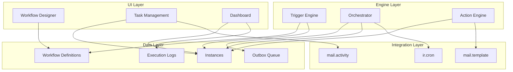

# BPM Automation Module - Implementation Plan

**Module:** `bpm_automation`
**Version:** 18.0.1.0.0
**Created:** 2026-01-30
**Target:** Odoo 18 Community/Enterprise

---

## Executive Summary

This plan outlines the implementation of a comprehensive Business Process Management (BPM) automation module for Odoo 18. The module enables administrators to build, edit, and manage business workflows through a step-based UI without writing code.

**Key Components:**
- 17 data models for workflow definitions, instances, triggers, actions, and monitoring
- Trigger engine supporting 10+ trigger types (record events, schedules, webhooks, manual, API)
- Execution engine with outbox pattern for reliable async processing
- 18+ action executors for records, communications, and integrations
- Human task system with approval workflows and escalation
- Parallel execution support with split/join workflows
- Monitoring dashboard with real-time instance tracking
- REST API and webhook endpoints for external integrations

---

## Architecture Overview

---

## Phase 1: Foundation Setup (Week 1)

### 1.1 Module Structure
- [ ] Create module directory structure under `custom_addons/bpm_automation/`
- [ ] Create `__manifest__.py` with dependencies
- [ ] Create `__init__.py` files in all directories
- [ ] Set up basic module metadata (name, version, description)

### 1.2 Security Setup
- [ ] Create security groups (User, Designer, Manager, Administrator)
- [ ] Set up access rights CSV file
- [ ] Create record rules for task visibility
- [ ] Define module category

### 1.3 Menu Structure
- [ ] Create root menu item
- [ ] Create sub-menus (Workflows, Instances, Tasks, Monitoring, Configuration)
- [ ] Set up menu icons and sequences

**Dependencies:** None
**Deliverables:** Module skeleton, security framework, menu structure

---

## Phase 2: Core Data Models (Week 1-2)

### 2.1 Workflow Models
- [ ] Implement `bpm.workflow` model
  - Basic fields (name, code, description, state, version)
  - Target model reference
  - Relations (steps, triggers, instances)
  - Computed statistics
  - Constraints (code_version_unique)
  
- [ ] Implement `bpm.workflow.step` model
  - Step types (action, condition, parallel_split, parallel_join, human_task, wait_event, delay, stop)
  - Flow control fields (next_step, is_start_step)
  - Condition gateway fields
  - Parallel split/join fields
  - Human task fields
  - Wait event fields
  - Delay/timer fields
  - Error handling fields

- [ ] Implement `bpm.action` model
  - Action types (update_record, create_record, delete_record, link_records, server_action, send_email, send_message, send_sms, create_activity, http_request, webhook_call, execute_python)
  - Target model configuration
  - Field mappings relation
  - Type-specific configuration fields

- [ ] Implement `bpm.action.field.map` model
  - Field mapping with value types (static, field, expression, context, jinja)

### 2.2 Trigger Models
- [ ] Implement `bpm.trigger` model
  - Trigger types (on_create, on_write, on_delete, on_field_change, on_condition, scheduled, deadline, webhook, manual, api)
  - Record trigger fields
  - Field change detection fields
  - Condition fields
  - Scheduled trigger fields
  - Webhook fields
  - Manual trigger fields
  - Deduplication fields

- [ ] Implement `bpm.webhook.endpoint` model
  - Token and endpoint URL
  - Security (secret_key, allowed_ips, signature requirement)
  - Rate limiting configuration
  - Call statistics

- [ ] Implement `bpm.webhook.call.log` model
  - Request/response logging
  - Processing status

- [ ] Implement `bpm.schedule.job` model
  - Cron job wrapper
  - Schedule configuration
  - Execution statistics

### 2.3 Execution Models
- [ ] Implement `bpm.workflow.instance` model
  - Instance state management
  - Source record reference
  - Context storage (JSON)
  - Current position tracking
  - Timing and error tracking
  - Control operations (pause, cancel)

- [ ] Implement `bpm.instance.step.log` model
  - Step execution tracking
  - Input/output storage
  - Error and retry information
  - Human task tracking
  - HTTP response tracking
  - Parallel branch tracking

- [ ] Implement `bpm.parallel.branch` model
  - Branch state management
  - Split/join tracking

- [ ] Implement `bpm.execution.log` model
  - Audit trail with log levels
  - Categorized messages

### 2.4 Task Models
- [ ] Implement `bpm.task` model
  - Human task management
  - Assignment logic
  - State transitions
  - Escalation tracking
  - Mail activity integration

- [ ] Implement `bpm.task.response` model
  - Task response tracking
  - Decision history

### 2.5 Queue Models
- [ ] Implement `bpm.outbox` model
  - Execution queue
  - Idempotency handling
  - State management
  - Scheduling and retry logic
  - Locking mechanism

### 2.6 Configuration Models
- [ ] Implement `bpm.config.setting` model
  - Key-value configuration
  - Type-safe values
  - Company-specific settings

- [ ] Implement `bpm.action.registry` model
  - Function whitelist for Python execution
  - Approval workflow
  - Parameter and return schemas

**Dependencies:** Phase 1
**Deliverables:** All 17 data models with fields, relations, constraints

---

## Phase 3: Trigger Engine (Week 2-3)

### 3.1 Trigger Engine Core
- [ ] Create `engine/trigger_engine.py`
  - Trigger cache management
  - Cache invalidation on trigger changes
  - Trigger matching logic

### 3.2 Record Event Handlers
- [ ] Implement `on_record_create()` method
  - Match on_create triggers
  - Filter by domain
  - Start workflow instances

- [ ] Implement `on_record_write()` method
  - Match on_write triggers
  - Handle on_field_change triggers
  - Field change detection logic

- [ ] Implement `on_record_delete()` method
  - Match on_delete triggers
  - Capture record data before deletion

### 3.3 Time-Based Triggers
- [ ] Implement `fire_scheduled()` method
  - Called by ir.cron
  - Process scheduled triggers
  - Support batch workflows

- [ ] Implement `check_deadline_triggers()` method
  - Cron job for deadline checking
  - Calculate target datetime
  - Prevent duplicate triggers

### 3.4 External Triggers
- [ ] Implement `fire_webhook()` method
  - Validate endpoint and trigger
  - Verify signature if required
  - Validate IP restrictions
  - Build context from payload
  - Handle correlation to source record

- [ ] Implement `fire_manual()` method
  - Check user permissions
  - Validate allowed groups

- [ ] Implement `fire_api()` method
  - Find active API trigger
  - Support record context
  - Return instance details

### 3.5 Workflow Initiation
- [ ] Implement `_start_workflow()` method
  - Check for duplicate instances
  - Build initial context
  - Create workflow instance
  - Log trigger event
  - Find and enqueue start step

- [ ] Implement `_enqueue_step()` method
  - Create step log
  - Create outbox entry with idempotency key
  - Update instance current position

### 3.6 ORM Trigger Mixin
- [ ] Create `models/bpm_trigger_mixin.py`
  - Override `create()` to trigger on_create workflows
  - Override `write()` to trigger on_write and on_field_change workflows
  - Override `unlink()` to trigger on_delete workflows
  - Implement `_bpm_get_watched_fields()` method
  - Implement `bpm_start_workflow()` method for manual triggering

### 3.7 Trigger Engine Model
- [ ] Create `models/bpm_trigger_engine.py`
  - Register as model for cron calls
  - Expose trigger engine methods

**Dependencies:** Phase 2
**Deliverables:** Complete trigger engine with all trigger types

---

## Phase 4: Execution Engine - Orchestrator (Week 3)

### 4.1 Orchestrator Core
- [ ] Create `engine/orchestrator.py`
  - Implement `process_outbox()` method (cron entry point)
  - Batch size configuration
  - Transaction handling

### 4.2 Item Acquisition
- [ ] Implement `_acquire_items()` method
  - Pessimistic locking with FOR UPDATE SKIP LOCKED
  - Worker identification
  - Lock timeout handling
  - Scheduled time filtering

### 4.3 Item Processing
- [ ] Implement `_process_item()` method
  - Validate instance state
  - Update step log to running
  - Get appropriate executor
  - Build execution context
  - Execute step with timing
  - Handle result

### 4.4 Executor Dispatch
- [ ] Implement `_get_executor()` method
  - Map step types to executor models
  - Handle unknown step types

### 4.5 Context Building
- [ ] Implement `_build_context()` method
  - Load instance context
  - Add metadata (_instance_id, _step_log_id, _workflow_code)
  - Add record reference if available
  - Add user, company, now

### 4.6 Result Handling
- [ ] Implement `_handle_result()` method
  - Dispatch to success or failure handlers

- [ ] Implement `_handle_success()` method
  - Update step log to done
  - Store output and context updates
  - Mark outbox item done
  - Enqueue next steps

- [ ] Implement `_handle_failure()` method
  - Update step log to failed
  - Check retry attempts
  - Schedule retry or handle final failure

### 4.7 Retry Logic
- [ ] Implement `_schedule_retry()` method
  - Exponential backoff calculation
  - Add jitter
  - Update outbox item for retry
  - Increment error count

- [ ] Implement `_handle_final_failure()` method
  - Mark outbox item failed
  - Execute on_error_step if configured
  - Mark instance as failed
  - Cancel pending items

### 4.8 Parallel Branch Management
- [ ] Implement `_enqueue_next_steps()` method
  - Handle parallel branch creation
  - Handle single next step
  - Handle wait events
  - Handle workflow completion

- [ ] Implement `_create_parallel_branches()` method
  - Create branch records
  - Enqueue first step for each branch

- [ ] Implement `_complete_branch()` method
  - Mark branch as done
  - Check join condition (all or any)
  - Execute join or cancel other branches

- [ ] Implement `_complete_workflow()` method
  - Mark instance as done
  - Set end time

### 4.9 Cron Configuration
- [ ] Create `data/cron_data.xml`
  - Orchestrator cron (every 1 minute)
  - Deadline check cron (every 15 minutes)
  - Escalation check cron (every 15 minutes)

**Dependencies:** Phase 3
**Deliverables:** Complete orchestrator with retry logic and parallel execution

---

## Phase 5: Step Executors (Week 4)

### 5.1 Base Executor
- [ ] Create `engine/executors/base.py`
  - Base executor class
  - `execute()` abstract method
  - `_safe_eval()` method for Python expressions
  - `_render_jinja()` method for templates

### 5.2 Action Executor
- [ ] Create `engine/executors/action.py`
  - Execute action via action engine
  - Pass context to action executor

### 5.3 Condition Executor
- [ ] Create `engine/executors/condition.py`
  - Evaluate condition expression
  - Return appropriate next step based on result
  - Handle expression errors

### 5.4 Parallel Executors
- [ ] Create `engine/executors/parallel_split.py`
  - Return list of parallel step IDs
  - Support branch configuration

- [ ] Create `engine/executors/parallel_join.py`
  - Wait for branches to complete
  - Handle join type (all/any)

### 5.5 Human Task Executor
- [ ] Create `engine/executors/human_task.py`
  - Resolve assignee (user, field, group, expression)
  - Calculate deadline
  - Create task record
  - Update step log to waiting
  - Handle task configuration

### 5.6 Wait Event Executor
- [ ] Create `engine/executors/wait_event.py`
  - Set instance to waiting state
  - Store event correlation data
  - Handle timeout

### 5.7 Delay Executor
- [ ] Create `engine/executors/delay.py`
  - Calculate delay (fixed, field, expression)
  - Return wait_until timestamp
  - Handle zero delay

### 5.8 Stop Executor
- [ ] Create `engine/executors/stop.py`
  - Mark workflow as completed/failed/cancelled
  - Store stop message

**Dependencies:** Phase 4
**Deliverables:** All 8 step executors

---

## Phase 6: Action Executors (Week 4-5)

### 6.1 Action Engine
- [ ] Create `engine/action_engine.py`
  - Map action types to executors
  - `execute_action()` method

### 6.2 Base Action Executor
- [ ] Create `engine/action_executors/base.py`
  - Base class for action executors
  - `_get_target_record()` method
  - `_get_target_model()` method
  - `_resolve_field_mappings()` method
  - `_render_jinja()` method
  - `_safe_eval()` method

### 6.3 Record Action Executors
- [ ] Create `engine/action_executors/update_record.py`
  - Get target record
  - Resolve field mappings
  - Write values with bpm_skip_triggers context
  - Return success with updated fields

- [ ] Create `engine/action_executors/create_record.py`
  - Get target model
  - Resolve field mappings
  - Create record with bpm_skip_triggers context
  - Return success with new record ID
  - Update context with created record info

- [ ] Create `engine/action_executors/delete_record.py`
  - Support archive (active=False) and unlink
  - Apply domain filter
  - Delete records

- [ ] Create `engine/action_executors/link_records.py`
  - Link two records via Many2many field
  - Support bidirectional linking

- [ ] Create `engine/action_executors/server_action.py`
  - Execute ir.actions.server
  - Pass context and record

### 6.4 Communication Executors
- [ ] Create `engine/action_executors/send_email.py`
  - Use mail.template if configured
  - Support custom email via mail.mail
  - Render Jinja templates for subject/body
  - Evaluate recipient expression

- [ ] Create `engine/action_executors/send_message.py`
  - Post to chatter via message_post()
  - Render message body
  - Evaluate partner IDs expression
  - Support custom subtypes

- [ ] Create `engine/action_executors/send_sms.py`
  - Use sms.template if configured
  - Support custom SMS
  - Render body template
  - Resolve phone number

- [ ] Create `engine/action_executors/create_activity.py`
  - Create mail.activity
  - Render summary and note
  - Resolve assignee
  - Set deadline

### 6.5 Integration Executors
- [ ] Create `engine/action_executors/http_request.py`
  - Render URL, headers, body with Jinja
  - Handle auth types (none, basic, bearer, api_key)
  - Make HTTP request with timeout
  - Validate success codes
  - Parse JSON response
  - Update context with response

- [ ] Create `engine/action_executors/webhook_call.py`
  - Call external webhook
  - Support custom payload template
  - Handle HMAC signature
  - Log call details

- [ ] Create `engine/action_executors/execute_python.py`
  - Execute sandboxed Python code
  - Provide safe eval context
  - Support registered function calls via whitelist
  - Capture output and errors

**Dependencies:** Phase 5
**Deliverables:** All 18 action executors

---

## Phase 7: Human Task System (Week 5-6)

### 7.1 Task Model Methods
- [ ] Implement `action_approve()` method
  - Update task state to completed
  - Store decision and comment
  - Resume workflow with on_approve step
  - Create task response record

- [ ] Implement `action_reject()` method
  - Update task state to completed
  - Store decision and comment
  - Resume workflow with on_reject step
  - Create task response record

- [ ] Implement `action_claim()` method
  - Assign task to current user
  - Update state to claimed

- [ ] Implement `action_delegate()` method
  - Reassign task to another user
  - Track delegation history

### 7.2 Task Escalation
- [ ] Implement `check_escalations()` method (cron)
  - Find expired tasks
  - Increment escalation level
  - Reassign to escalation user/group
  - Send notification
  - Update task record

### 7.3 Task Mail Activity Integration
- [ ] Create mail.activity when task is created
  - Link to source record
  - Set activity type
  - Set summary from task title
  - Set deadline
  - Assign to user

- [ ] Sync task completion with mail.activity
  - Mark activity done on task completion
  - Include decision comment

### 7.4 Task Views
- [ ] Create task form view
  - Approve/Reject buttons
  - Task instructions
  - Assignment info
  - Deadline display
  - Escalation level
  - Chatter

- [ ] Create task kanban view
  - Group by state
  - Show assignee avatar
  - Show deadline badge
  - Quick actions

- [ ] Create task tree view
  - List columns
  - Filters by state, assignee, deadline
  - Search by name

**Dependencies:** Phase 6
**Deliverables:** Complete human task system with escalation

---

## Phase 8: Webhooks & API (Week 6-7)

### 8.1 Webhook Controller
- [ ] Create `controllers/webhook.py`
  - Implement `webhook_handler()` route
  - Validate endpoint token
  - Check endpoint active status
  - Validate HMAC signature if required
  - Check IP restrictions
  - Call trigger engine
  - Update endpoint statistics
  - Log webhook call

### 8.2 REST API Controller
- [ ] Create `controllers/api.py`
  - Implement `list_workflows()` route (GET /api/bpm/workflows)
  - Implement `start_workflow()` route (POST /api/bpm/workflows/<code>/start)
  - Implement `get_instance()` route (GET /api/bpm/instances/<id>)
  - Implement `complete_task()` route (POST /api/bpm/tasks/<id>/complete)
  - Implement `get_task()` route (GET /api/bpm/tasks/<id>)
  - Add proper error handling
  - Return JSON responses

### 8.3 API Authentication
- [ ] Ensure all API routes require user authentication
- [ ] Add API key validation option
- [ ] Document API endpoints

**Dependencies:** Phase 7
**Deliverables:** Webhook endpoint and REST API

---

## Phase 9: Dashboard & Monitoring (Week 7)

### 9.1 Dashboard Views
- [ ] Create dashboard view
  - Workflow statistics (active, draft, disabled)
  - Instance statistics (running, completed, failed)
  - Task statistics (pending, claimed, expired)
  - Recent instances list
  - Failed instances list
  - System health indicators

### 9.2 Instance Views
- [ ] Create instance form view
  - Instance details
  - Step execution timeline
  - Context viewer
  - Control buttons (pause, resume, cancel, retry)
  - Error display
  - Chatter

- [ ] Create instance tree view
  - List columns
  - Filters by state, workflow, date
  - Group by workflow
  - Progress bar

- [ ] Create instance graph view
  - State distribution
  - Workflow distribution
  - Time-based metrics

### 9.3 Execution Log Views
- [ ] Create execution log tree view
  - Timestamp, level, category, message
  - Filters by level, category, instance
  - Search by message

- [ ] Add log viewer to instance form
  - Show all logs for instance
  - Expandable details

### 9.4 Workflow Views
- [ ] Create workflow form view
  - Basic info
  - Steps notebook with editable tree
  - Triggers notebook with editable tree
  - Statistics button box
  - State statusbar
  - Activate/Deactivate buttons

- [ ] Create workflow tree view
  - List columns
  - Filters by state, model
  - Group by state

- [ ] Create workflow graph view
  - State distribution
  - Model distribution

### 9.5 Action Views
- [ ] Create action form view
  - Action type selector
  - Dynamic fields based on type
  - Field mappings editable tree
  - Preview functionality

- [ ] Create action tree view
  - List columns
  - Filters by type

**Dependencies:** Phase 8
**Deliverables:** Complete UI with dashboard and monitoring

---

## Phase 10: Configuration & Polish (Week 8)

### 10.1 Configuration Settings
- [ ] Create `data/config_data.xml`
  - Default configuration settings
  - Orchestrator batch size
  - Retry delay and max retries
  - Log retention
  - Task deadlines
  - HTTP timeouts

### 10.2 Configuration Views
- [ ] Create settings form view
  - System parameters
  - Company-specific settings
  - Validation

### 10.3 Workflow Designer Enhancements
- [ ] Add step configuration wizard
  - Dynamic form based on step type
  - Preview next step connections
  - Validation

- [ ] Add trigger configuration wizard
  - Dynamic form based on trigger type
  - Test trigger button

- [ ] Add action configuration wizard
  - Dynamic form based on action type
  - Test action button
  - Field mapping builder

### 10.4 Testing & Debugging
- [ ] Add test workflow trigger button
  - Manually start workflow
  - Pass test context
  - View execution in real-time

- [ ] Add step execution preview
  - Show what will be executed
  - Preview context
  - Validate expressions

### 10.5 Documentation
- [ ] Create user guide
  - Getting started
  - Creating workflows
  - Managing tasks
  - Monitoring

- [ ] Create technical guide
  - Architecture overview
  - Extending with custom executors
  - API documentation
  - Troubleshooting

**Dependencies:** Phase 9
**Deliverables:** Configuration system, enhanced UI, documentation

---

## Phase 11: Testing (Week 9)

### 11.1 Unit Tests
- [ ] Test model methods
  - Workflow state transitions
  - Step validation
  - Trigger matching
  - Context building
  - Field mapping resolution

- [ ] Test executor methods
  - Condition evaluation
  - Delay calculation
  - Assignee resolution
  - Jinja rendering
  - Python expression evaluation

### 11.2 Integration Tests
- [ ] Test complete workflow execution
  - Simple linear workflow
  - Conditional branching
  - Parallel execution
  - Human task completion
  - Error handling and retry

- [ ] Test trigger types
  - Record create/write/delete
  - Field change detection
  - Scheduled triggers
  - Deadline triggers
  - Webhook triggers
  - Manual triggers
  - API triggers

### 11.3 API Tests
- [ ] Test webhook endpoint
  - Valid requests
  - Invalid tokens
  - Signature validation
  - IP restrictions

- [ ] Test REST API
  - List workflows
  - Start workflow
  - Get instance
  - Complete task
  - Error handling

### 11.4 Performance Tests
- [ ] Test large batch processing
  - 1000 instances
  - 10000 instances
  - Memory usage
  - Execution time

- [ ] Test concurrent execution
  - Multiple workflows running
  - Parallel branches
  - Lock contention

**Dependencies:** Phase 10
**Deliverables:** Comprehensive test suite

---

## Phase 12: Deployment & Final Polish (Week 10)

### 12.1 Deployment Preparation
- [ ] Verify all dependencies in __manifest__.py
- [ ] Create installation guide
- [ ] Create upgrade scripts if needed
- [ ] Test installation on fresh database
- [ ] Test upgrade from previous version

### 12.2 Performance Optimization
- [ ] Add database indexes
  - bpm.outbox (state, scheduled_at, idempotency_key)
  - bpm.workflow.instance (state, workflow_id, res_model, res_id)
  - bpm.instance.step.log (state, instance_id)
  - bpm.execution.log (timestamp, instance_id)

- [ ] Optimize queries
  - Review N+1 queries
  - Add prefetch hints
  - Optimize domain filters

### 12.3 Security Review
- [ ] Review access rights
- [ ] Review record rules
- [ ] Validate input sanitization
- [ ] Review SQL injection risks
- [ ] Review XSS risks in Jinja templates
- [ ] Test with different user roles

### 12.4 Final Testing
- [ ] End-to-end testing
- [ ] User acceptance testing
- [ ] Load testing
- [ ] Cross-browser testing for UI

### 12.5 Release Preparation
- [ ] Update version numbers
- [ ] Create release notes
- [ ] Update documentation
- [ ] Prepare demo workflows
- [ ] Create screenshots

**Dependencies:** Phase 11
**Deliverables:** Production-ready module

---

## Risk Assessment

| Risk | Impact | Mitigation |
|------|--------|------------|
| Complex parallel execution logic | High | Thorough testing, clear documentation |
| Performance issues with large queues | Medium | Indexing, batch processing, monitoring |
| Security vulnerabilities in Python execution | High | Whitelist approach, sandboxing, admin approval |
| Data loss in outbox pattern | Low | Idempotency keys, retry logic, transaction handling |
| UI complexity for workflow designer | Medium | Wizard-based configuration, validation, preview |

---

## Success Criteria

- [ ] All 17 models implemented with proper relations and constraints
- [ ] All trigger types functional and tested
- [ ] All step executors implemented and tested
- [ ] All action executors implemented and tested
- [ ] Human task system with escalation working
- [ ] Parallel execution with split/join working
- [ ] Webhook endpoint functional with security
- [ ] REST API functional with authentication
- [ ] Dashboard showing real-time metrics
- [ ] Test coverage > 80%
- [ ] Performance: Process 1000 workflow instances in < 5 minutes
- [ ] Documentation complete (user + technical)
- [ ] Security audit passed

---

## Next Steps

Once this plan is approved, the implementation should begin with Phase 1 (Foundation Setup). Each phase should be completed and tested before moving to the next phase. Regular code reviews and testing are recommended throughout the implementation.

**Estimated Timeline:** 10 weeks
**Total Tasks:** ~300+ individual implementation tasks
