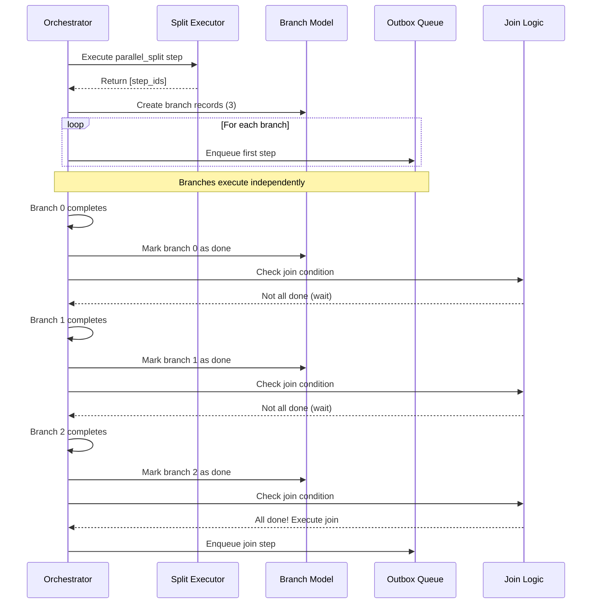

# BPM Parallel Execution Architecture

## Overview

Parallel execution in BPM Automation allows workflows to execute multiple branches concurrently, then synchronize at a join point. This is useful for:

- **Parallel approvals** - Require approval from multiple departments simultaneously
- **Concurrent operations** - Update multiple systems in parallel
- **Fan-out patterns** - Process multiple records independently
- **Race conditions** - Continue when any branch completes

---

## Architecture Components

### 1. Parallel Split Step

The `parallel_split` step type creates multiple independent branches that execute concurrently.

**Fields:**
- `parallel_step_ids`: Many2many to steps that form parallel branches
- `join_type`: 'all' (wait for all) or 'any' (continue on first)
- `join_step_id`: Reference to the `parallel_join` step

**Example Workflow:**
```
Start → Parallel Split → [Branch A] ─┐
                        [Branch B] ─┼→ Join → Continue
                        [Branch C] ─┘
```

### 2. Parallel Join Step

The `parallel_join` step waits for branches to complete based on the join type.

**Fields:**
- No additional fields (configuration is on the split step)

### 3. Parallel Branch Model

Tracks each branch's execution state.

**Fields:**
- `instance_id`: Workflow instance
- `split_step_log_id`: Reference to the split step's execution log
- `join_step_id`: The join step waiting for this branch
- `branch_index`: 0-based index (0, 1, 2...)
- `first_step_id`: The first step in this branch
- `state`: 'running', 'done', 'failed', 'cancelled'
- `started_at`, `ended_at`: Timing

---

## Execution Flow

### Step 1: Split Execution

When the orchestrator executes a `parallel_split` step:

```python
# In parallel_split executor
def execute(self, step, ctx):
    # Get all parallel branch steps
    parallel_steps = step.parallel_step_ids.sorted('sequence')

    # Return list of step IDs to execute in parallel
    return {
        'success': True,
        'next_step_ids': parallel_steps.ids,  # [101, 102, 103]
        'output': {
            'branch_count': len(parallel_steps),
            'branches': parallel_steps.mapped('name')
        }
    }
```

**What happens:**
1. Split executor returns list of next step IDs
2. Orchestrator detects `next_step_ids` (plural) in result
3. Creates branch records for each step ID
4. Enqueues first step of each branch to outbox

### Step 2: Branch Creation

```python
# In orchestrator
def _create_parallel_branches(self, instance, split_step_log, next_step_ids):
    for idx, step_id in enumerate(next_step_ids):
        branch = self.env['bpm.parallel.branch'].create({
            'instance_id': instance.id,
            'split_step_log_id': split_step_log.id,
            'join_step_id': split_step_log.step_id.join_step_id.id,
            'branch_index': idx,
            'first_step_id': step_id,
            'state': 'running',
            'started_at': fields.Datetime.now(),
        })

        # Enqueue first step for this branch
        next_step = self.env['bpm.workflow.step'].browse(step_id)
        self._enqueue_step(instance, next_step, branch_id=branch.id)
```

**Result:**
- 3 branch records created (if 3 parallel steps)
- Each branch has its own first step enqueued
- All branches are now in `bpm.outbox` queue
- They will be picked up by orchestrator cron

### Step 3: Branch Execution

Each branch executes independently:

```
Branch 0: Step A1 → Step A2 → Step A3 → (implicit join)
Branch 1: Step B1 → Step B2 → (implicit join)
Branch 2: Step C1 → Step C2 → Step C3 → (implicit join)
```

**Important:** When a branch completes its last step:
- It doesn't automatically proceed to join
- It calls `_complete_branch()` instead of `_enqueue_next_steps()`

```python
# In orchestrator
def _enqueue_next_steps(self, instance, step_log, result):
    step = step_log.step_id

    # ... handle other cases ...

    # If this step belongs to a branch
    if step_log.branch_id:
        self._complete_branch(step_log.branch_id)
        return
```

### Step 4: Branch Completion

```python
def _complete_branch(self, branch):
    # Mark branch as done
    branch.write({
        'state': 'done',
        'ended_at': fields.Datetime.now(),
    })

    instance = branch.instance_id
    join_step = branch.join_step_id

    # If no explicit join step, check if all branches done
    if not join_step:
        self._check_all_branches_complete(instance)
        return

    # Get all branches from this split
    split_log = branch.split_step_log_id
    all_branches = self.env['bpm.parallel.branch'].search([
        ('split_step_log_id', '=', split_log.id)
    ])

    # Check join type
    split_step = split_log.step_id
    join_type = split_step.join_type or 'all'

    if join_type == 'all':
        # Wait for ALL branches to complete
        if all(b.state == 'done' for b in all_branches):
            self._execute_join(instance, join_step, all_branches)
    elif join_type == 'any':
        # Continue on FIRST completed branch
        self._execute_join(instance, join_step, all_branches)
        # Cancel other running branches
        for b in all_branches:
            if b.state == 'running':
                self._cancel_branch(b)
```

### Step 5: Join Execution

```python
def _execute_join(self, instance, join_step, all_branches):
    # Aggregate results from all branches
    branch_results = []
    for branch in all_branches:
        # Get the last step log from this branch
        last_log = self.env['bpm.instance.step.log'].search([
            ('instance_id', '=', instance.id),
            ('branch_id', '=', branch.id)
        ], order='sequence desc', limit=1)

        branch_results.append({
            'branch_index': branch.branch_index,
            'state': branch.state,
            'last_step': last_log.step_id.name,
            'output': json.loads(last_log.output_result or '{}')
        })

    # Enqueue the join step
    self._enqueue_step(instance, join_step)

    # Update context with branch results
    ctx = json.loads(instance.context_json or '{}')
    ctx['_parallel_results'] = branch_results
    instance.write({'context_json': json.dumps(ctx)})
```

---

## Example Use Cases

### Use Case 1: Parallel Approvals

**Scenario:** Purchase order requires approval from Finance AND Manager simultaneously.

```
Start → Parallel Split
       ├→ [Finance Approval] ─┐
       └→ [Manager Approval] ─┼→ Join (all) → Continue
```

**Configuration:**
- Split step: `parallel_step_ids = [finance_step, manager_step]`
- Split step: `join_type = 'all'`
- Split step: `join_step_id = join_step`
- Finance step: `step_type = 'human_task'`, `assignee_type = 'group'`, `assignee_group_id = Finance`
- Manager step: `step_type = 'human_task'`, `assignee_type = 'user'`, `assignee_user_id = Manager`

**Execution:**
1. Split creates 2 branches
2. Finance task assigned to Finance group
3. Manager task assigned to specific user
4. Both tasks appear in task kanban
5. Workflow waits at join
6. When BOTH tasks approved → join executes → continue

**Context after join:**
```python
{
    '_parallel_results': [
        {
            'branch_index': 0,
            'state': 'done',
            'last_step': 'Finance Approval',
            'output': {'decision': 'approve', 'comment': 'Approved'}
        },
        {
            'branch_index': 1,
            'state': 'done',
            'last_step': 'Manager Approval',
            'output': {'decision': 'approve', 'comment': 'OK'}
        }
    ]
}
```

### Use Case 2: Race Condition (First to Respond)

**Scenario:** Send to multiple suppliers, use first response.

```
Start → Parallel Split
       ├→ [Call Supplier A] ─┐
       ├→ [Call Supplier B] ─┼→ Join (any) → Continue
       └→ [Call Supplier C] ─┘
```

**Configuration:**
- Split step: `join_type = 'any'`

**Execution:**
1. Split creates 3 branches
2. All 3 HTTP requests sent in parallel
3. Supplier B responds first
4. Join executes immediately
5. Branches A and C are cancelled
6. Continue with Supplier B's response

### Use Case 3: Concurrent Updates

**Scenario:** Update CRM, ERP, and Billing systems simultaneously.

```
Start → Parallel Split
       ├→ [Update CRM] ─┐
       ├→ [Update ERP] ─┼→ Join (all) → Notify User
       └→ [Update Billing] ─┘
```

**Configuration:**
- Each branch: `step_type = 'action'`, `action_type = 'http_request'`

**Execution:**
1. All 3 HTTP requests enqueued
2. Orchestrator picks them up (possibly in different cron ticks)
3. Each executes independently
4. When ALL complete → join → send notification

---

## Data Flow Diagram



---

## State Management

### Branch States

| State | Description | Transitions |
|-------|-------------|-------------|
| `running` | Branch is executing | → `done`, `failed`, `cancelled` |
| `done` | Branch completed successfully | → (final) |
| `failed` | Branch failed (error) | → (final) |
| `cancelled` | Branch was cancelled (join type 'any') | → (final) |

### Instance State During Parallel Execution

- Instance remains `running` during parallel execution
- Current position points to the split step
- Branches track their own progress
- Join step is not executed until condition met

---

## Error Handling

### Branch Failure

If a branch fails:

```python
# In orchestrator, when step fails
def _handle_failure(self, item, step_log, result, duration_ms):
    # ... retry logic ...

    if attempt >= max_attempts:
        # Check if this is a branch
        if step_log.branch_id:
            # Mark branch as failed
            step_log.branch_id.write({
                'state': 'failed',
                'error_message': error_msg
            })

            # For 'all' join type, this fails the entire workflow
            split_step = step_log.branch_id.split_step_log_id.step_id
            if split_step.join_type == 'all':
                # Cancel other branches
                other_branches = self.env['bpm.parallel.branch'].search([
                    ('split_step_log_id', '=', step_log.branch_id.split_step_log_id.id),
                    ('state', '=', 'running')
                ])
                for b in other_branches:
                    self._cancel_branch(b)

                # Mark instance as failed
                instance.write({'state': 'failed'})
```

### Join Type 'any' with Failures

If using `join_type = 'any'`:
- First branch to reach `done` state triggers join
- Other branches are cancelled (regardless of state)
- Failed branches don't prevent workflow continuation

### Join Type 'all' with Failures

If using `join_type = 'all'`:
- ALL branches must reach `done` state
- ANY branch failure marks instance as failed
- Other branches are cancelled

---

## Performance Considerations

### 1. Concurrent Execution

- Branches are enqueued to `bpm.outbox` independently
- Orchestrator cron picks up items as they become available
- Multiple branches can execute in the same cron tick
- No blocking between branches

### 2. Database Locking

- Branch creation is transactional
- Branch completion updates are transactional
- Join check uses `SELECT FOR UPDATE` on branch records
- Prevents race conditions in join logic

### 3. Scalability

- Each branch is an independent outbox item
- Can be processed by different workers (if multi-worker setup)
- No limit on number of branches
- Memory usage scales linearly with branch count

---

## Limitations & Considerations

### 1. Context Isolation

- Each branch has its own execution context
- Changes to context in one branch are NOT visible to other branches
- Join step receives aggregated results in `_parallel_results`
- Original context is preserved

### 2. Error Recovery

- Failed branches cannot be retried independently
- Entire parallel split must be re-executed
- Consider adding error handling steps in each branch

### 3. Branch Ordering

- Branches execute in order they're picked up by orchestrator
- No guaranteed execution order
- Use `branch_index` to identify branches in results

### 4. Join Complexity

- Complex join logic (e.g., "2 out of 3 branches") not supported
- Only 'all' and 'any' join types
- Custom join logic would require new step type

---

## Testing Strategy

### Unit Tests

```python
def test_parallel_split_creates_branches(self):
    workflow = self._create_workflow_with_parallel_split()
    instance = self._start_workflow(workflow)

    # Should create 3 branches
    branches = self.env['bpm.parallel.branch'].search([
        ('instance_id', '=', instance.id)
    ])
    self.assertEqual(len(branches), 3)

def test_join_all_waits_for_all(self):
    # Complete 2 of 3 branches
    self._complete_branch(0)
    self._complete_branch(1)

    # Join should NOT execute
    join_step = self._get_join_step()
    self.assertFalse(join_step.executed)

    # Complete 3rd branch
    self._complete_branch(2)

    # Join should execute
    self.assertTrue(join_step.executed)

def test_join_any_continues_on_first(self):
    # Complete 1 of 3 branches
    self._complete_branch(1)

    # Join should execute
    join_step = self._get_join_step()
    self.assertTrue(join_step.executed)

    # Other branches should be cancelled
    branch_0 = self._get_branch(0)
    branch_2 = self._get_branch(2)
    self.assertEqual(branch_0.state, 'cancelled')
    self.assertEqual(branch_2.state, 'cancelled')
```

### Integration Tests

```python
def test_parallel_approvals_workflow(self):
    # Create workflow with finance + manager approval
    workflow = self._create_parallel_approval_workflow()

    # Start workflow
    instance = workflow.trigger_ids[0].fire(record=self.sale_order)

    # Should create 2 tasks
    tasks = self.env['bpm.task'].search([
        ('instance_id', '=', instance.id)
    ])
    self.assertEqual(len(tasks), 2)

    # Approve finance task
    tasks[0].action_approve()

    # Workflow should still be running
    self.assertEqual(instance.state, 'running')

    # Approve manager task
    tasks[1].action_approve()

    # Workflow should complete
    self.assertEqual(instance.state, 'done')
```

---

## Summary

**Key Points:**

1. **Split Step** - Creates multiple independent branches
2. **Branch Model** - Tracks each branch's state
3. **Independent Execution** - Branches execute via outbox queue
4. **Join Logic** - Waits for 'all' or 'any' branches
5. **Result Aggregation** - Join receives results from all branches
6. **Error Handling** - Branch failures affect join based on type

**When to Use:**
- Multiple approvals needed simultaneously
- Independent operations that can run concurrently
- Race conditions where first response wins
- Fan-out processing of multiple items

**When NOT to Use:**
- Sequential dependencies between operations
- Shared context needed between branches
- Simple linear workflows
