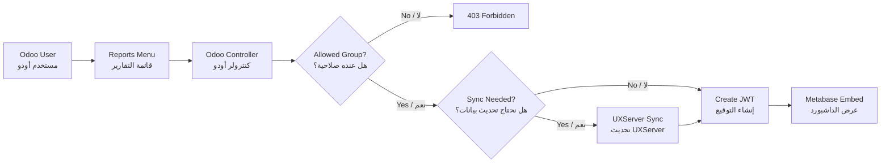

# SEDCO Metabase Reports | تقارير سيدكو في أودو

Simple guide for the `sedco_metabase_reports` Odoo 18 module.

دليل بسيط لموديول ربط تقارير Metabase داخل Odoo.

---

## 1. Big Idea | الفكرة

This module shows Metabase dashboards inside Odoo under **Reports**.

الموديول يعرض داشبوردات Metabase داخل Odoo من قائمة **Reports / التقارير**.

It does three main things:

| EN | AR |
| --- | --- |
| Shows dashboards inside Odoo | يعرض الداشبورد داخل أودو |
| Controls who can open each dashboard | يحدد من يستطيع فتح كل تقرير |
| Sends a signed JWT to Metabase for secure embed and optional row filters | يرسل توقيع JWT آمن مع فلتر اختياري حسب المستخدم |

---

## 2. Quick Map | خريطة سريعة



---

## 3. What We Built So Far | ماذا تم إنجازه؟

| Area | Done | Simple meaning |
| --- | --- | --- |
| Odoo menu | Yes | Added **Reports** menu and dashboard menu entries |
| Embed pages | Yes | `/metabase/reports` and `/metabase/embed/<code>` |
| Dashboard config model | Yes | Managers can configure dashboards from Odoo |
| Security groups | Yes | Viewer, Manager, Ops |
| JWT signing | Yes | Odoo signs short-lived Metabase embed tokens |
| Row filter modes | Yes | No filter, salesperson filter, manager bypass |
| Sync on open | Yes | Manager chooses No sync, Full reload, or Incremental per dashboard |
| Scheduled sync jobs | Yes | Managers can refresh selected models on a timing schedule |
| Incremental state | Yes | Last successful sync time is tracked per dashboard/job and model |
| Seeded dashboards | Yes | Sales Orders, Accounts, Contacts, Migration KPIs, Sync Health |
| Seeded sync models | Yes | Odoo model registry for UXServer refresh calls |

---

## 4. User Journey | رحلة المستخدم

1. User opens **Reports** in Odoo.
   المستخدم يفتح **Reports / التقارير**.

2. Odoo loads active dashboard records.
   أودو يقرأ الداشبوردات الفعالة.

3. Odoo checks the user's groups.
   أودو يتأكد من صلاحيات المستخدم.

4. User clicks a dashboard.
   المستخدم يختار التقرير.

5. Odoo optionally asks UXServer to refresh data.
   أودو ممكن يطلب تحديث البيانات من UXServer.

6. Odoo creates a signed Metabase JWT.
   أودو ينشئ توقيع Metabase آمن.

7. The dashboard opens in an iframe.
   الداشبورد تظهر داخل الصفحة.

---

## 5. Roles | الصلاحيات

| Role | Arabic | Can see | Can configure |
| --- | --- | --- | --- |
| Viewer | مشاهد | Sales Orders, Accounts, Contacts | No |
| Manager | مدير | Viewer dashboards + Migration KPIs | Yes |
| Ops | تشغيل | Migration KPIs, Sync Health | No |

Important: menu access is not the only protection.

مهم: إخفاء القائمة ليس الحماية الوحيدة.

The controller checks access again before creating the embed URL.

الكنترولر يتأكد من الصلاحية مرة ثانية قبل إنشاء رابط Metabase.

---

## 6. Main Files | الملفات المهمة

| File | What it does | شرح بسيط |
| --- | --- | --- |
| `__manifest__.py` | Module metadata and loaded XML | تعريف الموديول والملفات |
| `controllers/main.py` | Routes, permissions, sync, JWT | الراوتات والصلاحيات والتوقيع |
| `models/metabase_dashboard.py` | Dashboard configuration model | إعدادات الداشبورد |
| `models/metabase_sync_model.py` | Sync model registry | قائمة الموديلات التي يمكن تحديثها |
| `models/metabase_sync_line.py` | Per-model sync mode | نوع التحديث لكل موديل |
| `models/metabase_sync_schedule.py` | Scheduled sync jobs | وظائف التحديث المجدول |
| `models/metabase_sync_state.py` | Last successful sync time | وقت آخر تحديث ناجح |
| `security/metabase_groups.xml` | Viewer, Manager, Ops groups | مجموعات الصلاحيات |
| `views/metabase_templates.xml` | Reports page and iframe page | صفحات عرض التقارير |
| `views/metabase_dashboard_views.xml` | Manager configuration UI | شاشة إعدادات المدير |
| `views/metabase_sync_schedule_views.xml` | Scheduled sync configuration UI | شاشة إعدادات التحديث المجدول |
| `views/menus.xml` | Odoo menus and URL actions | قوائم أودو |
| `data/metabase_dashboards.xml` | Seed dashboard records | داشبوردات جاهزة كبداية |
| `data/metabase_sync_models.xml` | Seed sync model records | موديلات التحديث الجاهزة |
| `data/metabase_sync_schedule_cron.xml` | Cron that runs due schedules | كرون يشغل الجداول المستحقة |

---

## 7. Configuration Checklist | قائمة الإعداد

Set these in:

`Settings -> Technical -> Parameters -> System Parameters`

اضبط هذه القيم من إعدادات أودو:

| Parameter | Required? | Example | Meaning |
| --- | --- | --- | --- |
| `sedco_metabase_reports.site_url` | Yes | `http://localhost:3000` | Metabase URL |
| `sedco_metabase_reports.jwt_secret` | Yes | secret from Metabase | Embed signing secret |
| `sedco_metabase_reports.uxserver_url` | Optional | `https://uxserver.sedco.co` | UXServer URL for refresh |
| `sedco_metabase_reports.uxserver_sync_api_key` | Optional | API key | Key for `/api/OdooSyncReload` |

Only `site_url` is seeded with `http://localhost:3000`.

تم وضع `site_url` فقط كقيمة أولية. السر وبيانات UXServer لا يتم وضعها تلقائيا.

---

## 8. Dashboard Records | سجلات الداشبورد

Each dashboard is a record in `metabase.dashboard`.

كل داشبورد عبارة عن سجل داخل `metabase.dashboard`.

| Field | Simple meaning | معنى بسيط |
| --- | --- | --- |
| `name` | Display name | اسم التقرير |
| `code` | URL key, for example `sales_orders` | كود الرابط |
| `metabase_id` | Real dashboard ID from Metabase | رقم الداشبورد في Metabase |
| `allowed_group_ids` | Who can open it | من يستطيع فتحه |
| `filter_mode` | Filter behavior | طريقة الفلترة |
| `locked_parameter_name` | Metabase locked parameter name | اسم البراميتر المقفل في Metabase |
| `bypass_group_id` | Group that skips row filter | المجموعة التي تتجاوز الفلتر |
| `open_sync_mode` | No sync, Full reload, or Incremental | بدون تحديث، تحديث كامل، أو تحديث الفروقات |
| `sync_line_ids` | Per-model refresh rules | قواعد التحديث لكل موديل |

### Seeded Dashboards | الداشبوردات الجاهزة

| Code | Name | Access | Filter | Sync |
| --- | --- | --- | --- | --- |
| `sales_orders` | Sales Orders | Viewer, Manager | `salesperson_id`, manager bypass | Yes |
| `accounts` | Accounts | Viewer, Manager | No | Yes |
| `contacts` | Contacts | Viewer, Manager | No | Yes |
| `migration_kpis` | Migration KPIs | Manager, Ops | No | No |
| `sync_health` | Sync Health | Ops | No | No |

These records use `noupdate="1"`.

هذه السجلات تستخدم `noupdate="1"` حتى لا يتم مسح أرقام Metabase الحقيقية عند تحديث الموديول.

---

## 9. Interactive Sections | افتح القسم الذي تحتاجه

<details>
<summary><strong>How JWT security works | كيف يعمل JWT؟</strong></summary>

Odoo creates a short-lived token before showing the iframe.

أودو ينشئ توكن قصير المدة قبل عرض الداشبورد.

The token includes:

| Key | Meaning |
| --- | --- |
| `resource.dashboard` | Metabase dashboard ID |
| `params` | Locked filter values |
| `exp` | Expiry time |

Token lifetime is `600` seconds.

مدة التوكن الحالية `600` ثانية.

The algorithm is `HS256`.

</details>

<details>
<summary><strong>How row filtering works | كيف تعمل فلترة الصفوف؟</strong></summary>

The same name must match in three places:

لازم نفس الاسم يكون مطابقا في ثلاثة أماكن:

1. Odoo field: `locked_parameter_name`
2. Metabase locked parameter slug
3. Metabase SQL or dashboard filter

Example:

```json
{
  "salesperson_id": 42
}
```

If names do not match, the dashboard may open but show wrong data.

إذا الأسماء غير متطابقة، ممكن التقرير يفتح لكن يعرض بيانات غير صحيحة.

</details>

<details>
<summary><strong>How scheduled sync works | كيف يعمل التحديث المجدول؟</strong></summary>

Managers can create scheduled sync jobs from:

يمكن للمدير إنشاء وظائف تحديث مجدولة من:

`Reports -> Configuration -> Scheduled Sync Jobs`

Each job has:

كل وظيفة تحتوي على:

| Field | Meaning |
| --- | --- |
| `sync_line_ids` | Models to refresh, each with Full or Incremental |
| `interval_number` + `interval_type` | How often it runs |
| `next_run` | Next planned run time |
| `last_status` | Last result |
| `last_message` | Last UXServer message |
| `Run Now` | Manual test button |

A fixed Odoo cron checks due jobs every minute and calls UXServer with the selected models.

كرون ثابت في أودو يفحص الوظائف المستحقة كل دقيقة ويرسل الموديلات المختارة إلى UXServer.

`sync_line_ids` is the source of truth. One job can mix modes:

`sync_line_ids` هو المصدر المعتمد. نفس الوظيفة يمكن أن تجمع أكثر من نوع:

| Model | Mode |
| --- | --- |
| `sale.order` | `full` |
| `res.partner` | `incremental` |

`Full reload` means: delete/rebuild the selected SQL tables.

`Incremental` means: compare Odoo `write_date` with the saved `last_synced_at`, then update only changed records.

`Full reload` يعني: إعادة بناء الجداول المختارة بالكامل.

`Incremental` يعني: تحديث السجلات التي تغيرت فقط بعد آخر تحديث ناجح.

Use scheduled sync for heavy or shared models such as `res.partner`, `res.users`, `res.country`, `res.currency`, and lookup tables.

استخدم التحديث المجدول للموديلات الكبيرة أو المشتركة مثل العملاء والمستخدمين والدول والعملات.

</details>

<details>
<summary><strong>How on-demand sync works | كيف يعمل تحديث البيانات؟</strong></summary>

Each dashboard uses per-model `sync_line_ids`:

كل داشبورد يستخدم قواعد لكل موديل `sync_line_ids`:

| Row mode | Meaning | معنى |
| --- | --- | --- |
| Empty lines | Do not sync when opening | لا تحدث عند الفتح |
| `full` | Rebuild this model before opening | أعد بناء هذا الموديل قبل العرض |
| `incremental` | Sync changed records for this model only | حدث التغييرات لهذا الموديل فقط |

For mixed mode, use sync lines:

لدمج النوعين، استخدم سطور التحديث:

| Model | Mode |
| --- | --- |
| `sale.order` | `full` |
| `res.partner` | `incremental` |

If UXServer settings exist and the dashboard has visible sync lines, Odoo sends:

إذا إعدادات UXServer موجودة والداشبورد فيه سطور تحديث ظاهرة، أودو يرسل:

```http
POST <uxserver_url>/api/OdooSyncReload
Content-Type: application/json
X-API-KEY: <uxserver_sync_api_key>
```

Body:

```json
{
  "models": ["sale.order", "sale.order.line", "res.partner"],
  "mode": "full"
}
```

Incremental body:

```json
{
  "models": ["res.partner"],
  "mode": "incremental",
  "since": {
    "res.partner": "2026-04-25 09:00:00"
  }
}
```

If sync fails or times out, the dashboard still opens with a stale-data warning.

إذا فشل التحديث أو أخذ وقت طويل، التقرير يفتح مع تحذير أن البيانات قديمة.

For production, prefer scheduled sync for common data and keep on-demand sync only for reports that truly need refresh-before-open.

للإنتاج، الأفضل استخدام التحديث المجدول للبيانات المشتركة، وترك التحديث عند فتح التقرير فقط للتقارير التي تحتاج ذلك فعلا.

</details>

<details>
<summary><strong>How to add a dashboard | كيف تضيف داشبورد؟</strong></summary>

In Metabase:

1. Create the dashboard.
2. Publish it for signed embedding.
3. Copy the numeric dashboard ID.
4. If needed, add a locked parameter such as `salesperson_id`.

In Odoo:

1. Go to **Reports -> Configuration -> Metabase Dashboards**.
2. Create a new record.
3. Fill `name`, `code`, `metabase_id`, and `allowed_group_ids`.
4. Choose `filter_mode`.
5. Add `locked_parameter_name` if filtering is used.
6. Add `sync_line_ids` if data should refresh before opening.
7. Choose `full` or `incremental` for each model line.
8. Leave `sync_line_ids` empty if the dashboard should open without sync.

Note: menu entries are currently XML-defined. A new dashboard record makes the route work, but a dedicated menu item still needs XML.

ملاحظة: القوائم حاليا معرفة في XML. إضافة سجل داشبورد تجعل الرابط يعمل، لكن ظهور عنصر قائمة جديد يحتاج XML.

</details>

<details>
<summary><strong>Troubleshooting | حل المشاكل</strong></summary>

| Problem | Check |
| --- | --- |
| `Embed not configured` | `site_url`, `jwt_secret`, and `metabase_id > 0` |
| `403 Forbidden` | User group, dashboard active, allowed groups |
| Wrong data | `filter_mode`, parameter name, Metabase filter slug |
| Stale-data warning | UXServer URL, API key, endpoint health, timeout |
| Menu not visible | User group and menu XML group |

</details>

---

## 10. Current Limitations | الحدود الحالية

| Limitation | Meaning |
| --- | --- |
| Menus are XML-defined | New dashboards do not automatically create menu entries |
| Full sync can still run during page open | Use scheduled sync or incremental mode for common/heavy data |
| Incremental sync does not detect hard deletes | Run periodic full reload for cleanup |
| Metabase content is external | This module embeds dashboards but does not create Metabase dashboards |

See `TASKS.md` for the hardening backlog.

راجع `TASKS.md` لمهام التحسين القادمة.

---

## 11. Install / Update Checklist | خطوات التثبيت أو التحديث

- [ ] Install or update the module.
- [ ] Set `site_url`.
- [ ] Set `jwt_secret`.
- [ ] Publish dashboards in Metabase.
- [ ] Enter real `metabase_id` values in Odoo.
- [ ] Assign users to Viewer, Manager, or Ops.
- [ ] Create scheduled sync jobs for shared/heavy models.
- [ ] Test with one Viewer user.
- [ ] Test with one Manager user.
- [ ] Test UXServer sync if enabled.
- [ ] Open every menu item and confirm the iframe renders.

---

## 12. One-Minute Explanation | شرح بدقيقة

`sedco_metabase_reports` is the bridge between Odoo users and Metabase dashboards.

هو جسر بين مستخدمي Odoo وتقارير Metabase.

Odoo decides **who** can open a report. Metabase shows **the dashboard**. The JWT connects them securely.

أودو يقرر **من** يفتح التقرير. Metabase يعرض **الداشبورد**. و JWT يربط الاثنين بشكل آمن.
